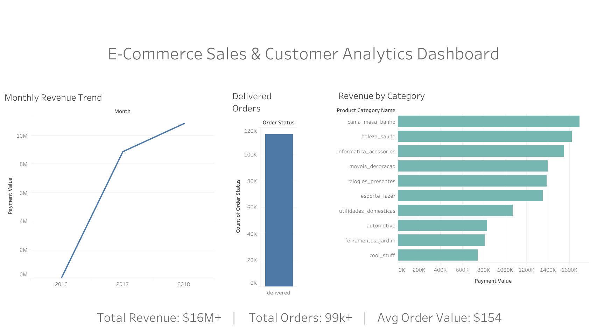

# 📊 E-Commerce Sales & Customer Analytics

## Project Overview

This project focuses on analyzing e-commerce transactional data to understand sales performance, customer behavior, and product category contribution. The objective was to simulate a real-world data analytics workflow by answering business-driven questions using SQL and Python, and presenting insights through an interactive Tableau dashboard.

---

## Business Questions Addressed

* How does monthly revenue trend over time?
* Which product categories generate the highest revenue?
* What is the distribution of order statuses?
* Who are the top customers by total spend?
* What is the average order value (AOV)?

---

## Tools & Technologies Used

* **SQL (SQLite)** – Data extraction, joins, aggregations, and KPI calculations using DB Browser for SQLite
* **Python (Jupyter Notebook)** – Data cleaning and exploratory data analysis using pandas and matplotlib
* **Tableau** – Dashboard creation and visualization of business insights

---

## Analysis Approach

1. Imported and explored multiple relational tables including orders, customers, products, payments, and order items.
2. Used SQL to join datasets and compute key metrics such as revenue trends, category-level performance, customer spend, and order status distribution.
3. Validated and explored insights further using Python through exploratory data analysis.
4. Designed a Tableau dashboard to clearly communicate findings to non-technical stakeholders.

---

## Key Insights

* Monthly revenue demonstrated a clear upward trend, indicating consistent business growth.
* A limited number of product categories contributed a significant portion of total revenue.
* Delivered orders accounted for the majority of total transactions.
* High-value customers had a disproportionate impact on overall revenue.
* The average order value remained relatively stable across the analyzed period.

---

## Dashboard

The final dashboard summarizes sales performance, order trends, and category-level insights in a single view.

---

## Notes

* Product category names are in Portuguese, as provided in the original dataset.
* Revenue values are represented in the original dataset currency.
* Raw CSV files are not included in this repository due to size constraints.

---

## Dataset

This project uses the **Olist Brazilian E-Commerce Public Dataset**, which contains real transactional data from an online marketplace.
